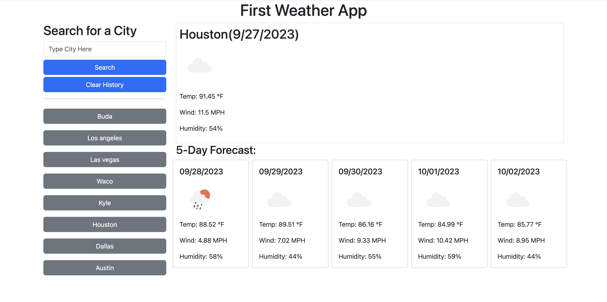

# First Weather App

## Repository

In this repository you will find the application code to a weather app. The purpose of this application is to provide an easy way to search a city's weather by typing in the city name. The API requests return data that display the current weather, along with a 5-day forecast. The current weather will be displayed at the top section which is larger than the section that holds the 5 day forecast. The following information will be displayed if the fetch is successful:

- City Name
- Date
- A weather icon from the Open Weather API
- Temperature
- Wind
- Humidity

The biggest challenge I had during the proccess of making thie application was getting the 5 day forecoast to display exactly how I wanted it to. The second biggest challenge was working with local storage to get the search history buttons to appear and get them to call the API fetch when clicked on. It wasn't necessarily getting this to work but more so, fixing bugs that were caused because of the way I wrote the code. It took meticulous inspection of my own code and running it multiple times to find ways where I could improve and help get rid of some of the bugs that were happening.

## Table of Contents

- [Contribute](#contribute)
- [Appearance](#appearance)
- [Changes](#changes)
- [Features](#features)
- [Credits](#credits)
- [License](#license)

## Contribute

To view the repository of this weather app and contribute to this application click the following link:  [First Weather App Repo](https://github.com/lmansilla92/first-weather-app)

If you need help on how to clone a GitHub repository into your local repository, visit the following GitHub link: [Cloning a repository](https://docs.github.com/en/repositories/creating-and-managing-repositories/cloning-a-repository) 

## Appearance

Deployed Screenshot:
    

To view the deployed webpage click the following link: [Deployed Webpage](https://lmansilla92.github.io/coding-quiz-challenge)

## Changes

I would like to make the following changes to this weather app:

- Add more styling to the page with bootstrap
- Change the background image of the page to an image of the city being searched
- Add a night mode when searches are being made after a certain hour

## Features

Some of the features in this application include:

- Use of API data
- Local Storage

## Credits

Open Weather Map API [https://openweathermap.org/]

## License

Link to [The MIT License (MIT)](https://github.com/lmansilla92/coding-quiz-challenge/blob/main/LICENSE)